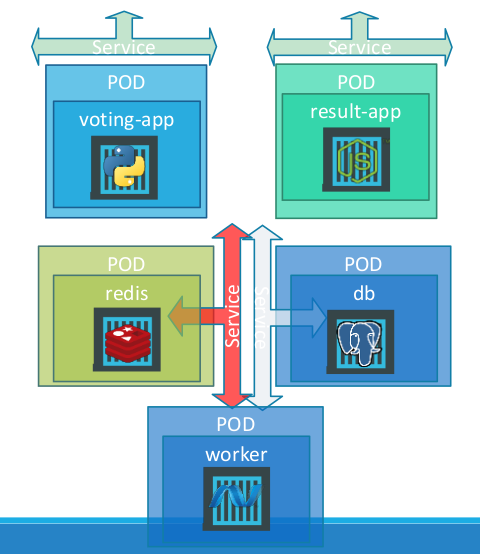

## Voting App With
* This Project demonstrate deploying microservices in a kubernetes using pods, services (NodePort & ClusterIP)

### Components
    - voting-app (Python)
        * Image: kodekloud/examplevotingapp_vote:v1
        * Port: 80
    - result-app
        * Image: kodekloud/examplevotingapp_result:v1
        * Port: 80
    - worker-app
        * Image: kodekloud/examplevotingapp_worker:v1
    - redis
        * Image: redis
        * Port: 6379
    - postgres
        * Image: postgres
        * Port: 5432
        * Env:
          * POSTGRES_USER: "postgres"
          * POSTGRES_PASSWORD: "postgres"
### Reference Diagram

